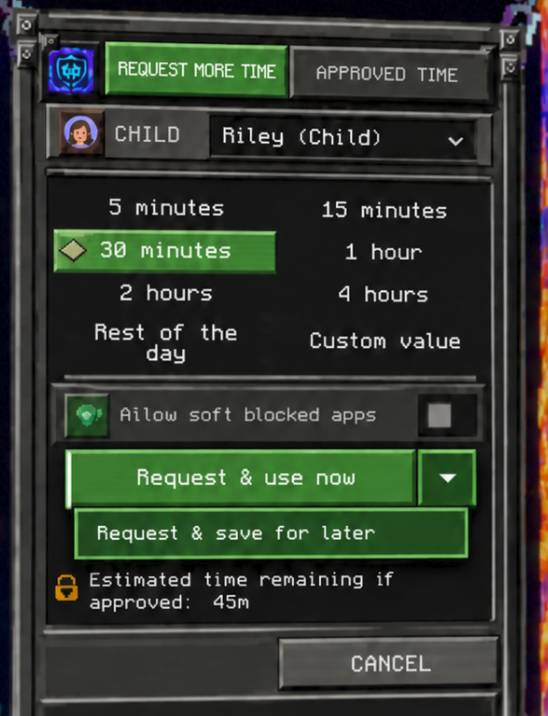
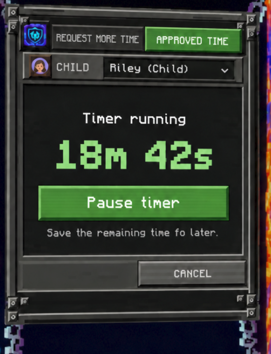

# Save approved time for later

## Status and reading route

This is the proposed end-to-end implementation design for **kiosk-only deferred
approval and manual pause/resume**. It records the agreed customer behavior and
GUI direction from the design discussion, plus explicit engineering decisions
needed to implement them. No feature implementation or installed acceptance is
claimed by this document or its draft images.

Start product work at [System design](System-Design.md), then use this document
as the feature handoff. The current [specification](Specification.md),
[screen-time design](SystemDesign/Screen-Time.md),
[broker transactions](SystemDesign/Broker.md#authorization-and-grant-transactions),
[state ownership](SystemDesign/State.md), and
[front ends](SystemDesign/Frontends.md) describe the pre-feature implementation.
Update their affected contracts when implementing this design; do not present
the proposed behavior as already shipped.

The feature does not require changes to GDM, GNOME Shell internals, PAM ordering,
or Malcontent's meaning of an active extension. The following decisions are
part of this proposed design: the balance formula, treatment of rest-of-day and
legacy grants, app-policy timing, and recovery protocol. They are made explicit
below so a new session does not have to infer them from screenshots.

## Customer contract

- A parent can approve additional time in the kiosk for immediate use or for
  later use. Both request modes authenticate the selected parent.
- Requesting time for later also saves the remaining active grant. After
  approval, the combined grant is saved and its timer is stopped.
- The kiosk can pause an existing active grant without another parent approval.
- The kiosk's **Use saved time** action starts either paused time or time
  approved in advance. These are the exact same backend operation and state.
- A saved fixed-duration grant survives kiosk exit, logout, broker restart,
  shutdown, and reboot without losing seconds.
- Opening the kiosk, locking, switching users, signing out, or suspending does
  not automatically pause an active grant. Time runs until the pause/save
  transaction takes effect. Once restarted, it runs during the return to sign-in
  and password entry, as well as subsequent lock/suspend/power-off intervals.
- Save-for-later, Pause, and Use saved time are available only in the dedicated
  kiosk session. The child-session overlay retains its current title, layout,
  and immediate, parent-authenticated request action. It gets no tabs or timer
  management controls. Backend authorization enforces this separation too.
- Parent **Revoke** clears both running and saved grants, including when only a
  saved grant exists. Existing strict-app-policy and termination behavior remains.
- Daily allowance is independent. Pausing a one-time grant does not pause daily
  accounting, clear daily allowance, or promise to prevent desktop access while
  daily time remains. An approval's app choice remains separate from time.

This is manual pause/resume through the kiosk. Automatic pause on lock or automatic
redemption at login/unlock is outside the feature.

## Why redemption happens in the kiosk

Today the broker writes the public AccountsService property
`ActiveExtension = (issued_at_epoch_seconds, duration_seconds)`. Its remaining
time is `max(0, issued_at + duration - now)`. There is no native deferred/paused
state in that property. The current grant therefore ticks while locked or away.

There are also two different entry restrictions:

1. PAM time checks protect authentication/account admission. Our authentication
   module calls the Malcontent library; `pam_malcontent` is a separate module
   invoked by the system PAM stack during account management.
2. GNOME Shell 50's retained-session unlock UI independently replaces password
   entry with a time-exhausted shield and an **Ignore** button. That shield is
   driven by Shell's time-limit state, not by our PAM module's rejection.

Consequently, a PAM redemption hook alone cannot guarantee that an exhausted
retained session offers password entry. Earlier proposals to skip Malcontent
checks, toggle `LimitType`, or redeem only after unlock are superseded.

The supported flow is:

```text
Locked child desktop (or no child desktop)
  -> switch to the dedicated kiosk
  -> select child -> Approved time -> Use saved time
  -> broker commits a normal ActiveExtension
  -> kiosk returns to sign-in
  -> return to retained child desktop or start a fresh login
  -> normal time checks and password authentication
```

Malcontent's policy-change/estimate notifications let Shell observe the new
grant. The implementation must qualify that the existing lock-screen shield
actually clears on the supported Ubuntu 26.04 / GNOME 50 environment. A stale
shield is a behavior mismatch to diagnose through public interfaces, not a
reason to patch private Shell state. The child password is still required.

No lock-screen button is hidden or replaced. No product code calls Shell's
native **Ignore** action, takes over Malcontent's extension agent, fakes usage,
sets a distant future grant, or continually renews a temporary grant. The broker
uses its existing verified AccountsService adapter to issue real access.

Upstream sources inspected for this design:

- [Malcontent ActiveExtension contract](https://gitlab.freedesktop.org/pwithnall/malcontent/-/blob/0.14.0/accounts-service/com.endlessm.ParentalControls.SessionLimits.xml).
- [GNOME 50 parental-controls shield and Ignore action](https://github.com/GNOME/gnome-shell/blob/50.0/js/gdm/authPrompt.js).
- [GNOME 50 unlock state integration](https://github.com/GNOME/gnome-shell/blob/50.0/js/ui/unlockDialog.js).
- [GNOME 50 time-limit manager](https://github.com/GNOME/gnome-shell/blob/50.0/js/misc/timeLimitsManager.js).

## GUI specification and supplied drafts

The supplied images are visual design references, not screenshots of implemented
behavior. They retain the current metal frame, pixel font, green selected/action
surfaces, account artwork, compact proportions, and background.

**In the kiosk, the two tab headers replace the “Oh No! Parent Control” title.**
Keep the small app icon. Order the tabs **Request more time**, then **Approved
time**. The shared child selector sits immediately below the tabs, as shown in
the drafts, and its selection applies to both pages. Preserve the shared form's
responsive/scaled layout rather than hardcoding these image dimensions.

### Request more time



- Preserve duration options, custom validation, soft-app selection, remembered
  request choices, estimate/status area, and Cancel.
- **Retain the approving-parent selector.** Its absence from this draft is an
  omission, not permission to remove account selection or selected-parent
  authentication. It belongs only in this tab, between child and duration fields.
- Primary split-button action: **Request & use now**.
- Dropdown action: **Request & save for later**.
- The dropdown is a menu/popover, not a permanently expanded second button.
  Dismiss it on selection, outside click, or Escape without submitting a request.
- Both modes use the same duration/app validation and selected-parent Polkit
  flow. The trusted prompt must explicitly name immediate versus saved use and
  explain that saved use pauses any existing grant. UI mode cannot change during
  authentication and cannot be silently substituted after authorization.
- The estimate includes saved time, uses current balances, and distinguishes
  “remaining if approved” from “saved if approved” for the selected action. It is
  advisory; commit recalculates after authentication. Invalid-input, loading,
  authorization, and failure messages take precedence over estimates.
- Immediate success retains the existing confirmation/exit behavior. Saved
  success stays in the kiosk and selects Approved time with the committed saved
  balance; do not automatically start it or exit before that state is visible.
- The screenshots' 30-minute selection and 45-minute estimate are illustrative;
  they are not the numeric inputs for the 18 + 20 scenario below.

### Approved time: saved


Show **Saved for later**, the saved one-time balance, **Use saved time**, and
“Start the timer and return to sign-in.” Do not distinguish paused from newly
approved time in the primary action or invent a separate Resume endpoint.
The draft's 30m is illustrative; the combined scenario must display about 38m.
Successful redemption uses the existing exit-to-sign-in route. Its confirmation
must not suggest that the timer waits for password entry.

### Approved time: running



Show **Timer running**, the live remaining one-time balance, **Pause timer**, and
“Save the remaining time for later.” Displayed time continues to decrease while
the kiosk is open. Successful pause stays on this tab and changes it to the saved
state. Do not show Pause and Use saved time simultaneously.

### Other UI states and shared behavior

| State | Approved time page |
| --- | --- |
| No active or saved grant | “No approved time available” and an action selecting Request more time; daily-only time does not enable Pause |
| Loading or failed read | Loading/unavailable text with retry; never render an unknown balance as zero |
| Mutation pending | Disable account/tab changes and competing mutations; show bounded progress and retain the selected child |
| Recovery pending | “Time status unavailable” with retry; no speculative saved/running balance or mutation |
| Screen-time control off | Existing disabled-control explanation; no pause, redeem, or request operation |
| Deadline-capped saved grant | Saved balance plus a concise “Available until …” explanation; never imply indefinite preservation |

Open Request more time by default to preserve today's initial task. Returning
from Pause/save selects Approved time. Within one form, preserve the selected tab
when switching children but discard stale asynchronous replies. Tab switching
does not save a request, authenticate, pause, redeem, or reset duration choices.
Cancel/Escape closes the form using current rules; closing does not pause time.

Use existing duration formatting and error-report routes. Only the approved
time page has the large one-time balance; do not relabel daily time as saved.
Retain window/application accessibility identity even though the visible title
is replaced. Add stable public accessible IDs and selected/disabled state for
both tabs, balances, status, split menu, and timer actions. Reuse existing IDs
for unchanged fields and test both shared-form surfaces.

## Two end-to-end scenarios

### Scenario 1: approve now, save the combined grant, use it later

Precondition: screen-time control is enabled for Riley; daily allowance is zero
for the numeric example. Riley has an active grant and locks the desktop.

1. Riley switches to the kiosk and selects Riley. The active grant keeps ticking.
2. On Request more time, select the parent, Custom **20 minutes**, the app choice,
   and **Request & save for later**.
3. The selected parent authenticates in the trusted prompt. Assume **18 minutes
   remain at the broker's approval calculation**, not at form opening.
4. The broker calculates `18 + 20 = 38 minutes`, commits the saved balance, and
   clears `ActiveExtension` to `(0, 0)` through the shared defer operation.
5. Kiosk displays Approved time: **Saved for later — 38m**. Waiting does not reduce
   this fixed-duration balance. Closing the kiosk, signing out, and rebooting
   preserve it. Riley's existing locked desktop is retained unless the machine
   is rebooted; pausing itself never logs the child out.
6. Later, Riley opens the kiosk, selects Riley, and clicks **Use saved time**.
7. Broker moves those saved seconds to a normal active grant exactly once and
   clears the spendable saved balance. The timer starts now; kiosk returns to
   sign-in. Riley can unlock the retained desktop or log in after reboot using
   the normal password, with the return/login interval deducted.
8. After natural exhaustion with daily time still zero, the normal restriction
   returns. No saved copy remains for a second redemption.

The same scenario starts from zero active time: approving 20 fixed minutes for
later saves 20 minutes in grant-only mode. No child login is needed to store or
redeem it. Parent denial/cancellation preserves the prior state, allowing only
the ordinary elapsed decrease of an already running grant.

### Scenario 2: pause existing granted time, then use it later

1. Riley uses an active grant, locks the screen, and opens the kiosk.
2. On Approved time, click **Pause timer**. At the broker's transfer point,
   suppose **18m 42s** remain.
3. Without a new parent prompt, the same defer backend saves those seconds and
   clears `ActiveExtension`. The page becomes **Saved for later — 18m 42s**.
4. Wait, exit, restart the broker, or reboot. The fixed-duration balance stays
   unchanged. A second Pause cannot add another copy of the old active grant.
5. Later click **Use saved time**. This calls exactly the same redemption method
   as Scenario 1, starts the saved seconds, and returns to sign-in.
6. Repeat pause/use cycles. Total granted seconds are conserved across transfers;
   only running intervals consume time. Another child's balance and session are
   unaffected.

These are separate customer acceptance cases even though their transitions share
backend code and reusable test blocks.

## State machine and time arithmetic

Use one grant per child with `empty`, `running`, `saved`, and an internal
`transitioning/recovery` state. Retain expired-running metadata needed for the
current strict-policy reconciliation; an expired grant has zero usable seconds.
Do not create a queue of independently redeemable grants.

```text
New parent approval, immediate --------------------> running
New parent approval, save later ---> shared defer -> saved
running -- Pause timer -----------> shared defer -> saved
saved ---- Use saved time -------> shared redeem -> running
running/saved ---------------------- Revoke ------> empty
```

At a single authoritative evaluation time, define:

- `D`: current daily allowance remaining, calculated from validated Malcontent use.
- `A`: running-grant remaining seconds; zero without a current active grant.
- `S`: effective saved-grant seconds; zero without a saved grant.
- `N`: newly approved fixed-duration seconds, within current request bounds.

Normal committed state has **at most one of A and S positive**. A recovery journal
is not an additional spendable balance. An unexpected live grant alongside a
saved record is a conflict to reconcile, not permission to sum both.

```text
Approved one-time balance G = max(A, S)
Total including saved time T = max(D, G)
Usable on the desktop now U = max(D, A)
Fixed new approval C = max(D, A, S) + N

Approve immediately:  running := C; saved := 0
Approve for later:    saved := C; ActiveExtension := (0, 0)
Pause:               saved := A; ActiveExtension := (0, 0)
Use saved time:       ActiveExtension := (now, S); saved := 0
```

**Pause and redemption do not run new-approval arithmetic.** They never add daily
time or requested minutes. With D=10m and A=20m, pause yields S=20m and T=20m,
not 30m. With D=10m, S=20m, and N=5m, a new approval yields 25m, not 35m.
This replaces the earlier discussion's `max(D,A)+S` proposal, which would double
count a moved balance. Resume creates exactly S active seconds, even if D is
larger; the daily allowance independently remains usable.

As today, new approval converts the larger existing balance plus N into a
one-time grant. Therefore a daily remainder included in C becomes part of that
approved grant and may survive a day boundary once saved. Do not describe this
as daily allowance itself rolling over, and do not add that daily remainder
again on redemption. This is the deliberate consequence of preserving the
existing approval formula while including saved approvals.

All newly approved immediate requests use the same C calculation, including an
ordinary parent-authenticated child-overlay request. Such a new approval replaces
the existing saved/running grant and starts C; it must not leave a saved copy.
This does not expose a child-callable Pause or unauthenticated redemption method.
Include saved time in the existing estimate/approval explanation so that using
it as part of the new approval is not hidden. No child-overlay controls change.

Use integer seconds, reject invalid values and uint32 overflow, and retain
current clipping/merging of daily usage. Do not treat a failed usage read as zero.
Capture A late, after authentication/preflight and immediately before the durable
transfer intent, rather than reusing the earlier form estimate. Use the same
capture for all balance writes within that transaction.

### Rest of the day and pre-feature grants

Keep today's immediate rest-of-day behavior: replace the one-time grant with
access until the next local midnight, even if an older fixed grant ended later.
Saving or pausing such a grant carries a fixed `valid_until` for that same
midnight. Effective S is `min(stored_seconds, max(0, valid_until - now))`.
Redemption never moves that deadline. Display the deadline in saved UI; it is
not a frozen fixed-duration bank. Midnight calculation must retain timezone/DST
handling. A later parent-approved fixed request replaces the mode/deadline using
normal fixed-request arithmetic; a new rest-of-day request replaces the balance.

Existing ActiveExtension tuples do not reveal whether they came from fixed or
rest-of-day approval. During one-time compatibility adoption, preserve the exact
tuple and label its mode `legacy-deadline`, capped at its original expiry. If
paused, it stays capped at that expiry. Never guess its mode and accidentally
extend an old rest-of-day authorization across midnight. New approvals have
explicit mode metadata and get the full fixed-duration saving behavior.

## Shared backend and authorization

Implement one policy core operation, conceptually
`defer_grant(validated_context, optional_new_approval)`, used by **both** Pause
and Request & save for later. It owns the read, calculation selection, durable
saved-state transition, ActiveExtension clear/read-back, revision, and result.
Entry points only supply their authorization and optional new approved amount
and app choice. Do not duplicate the transaction in two handlers, or issue an
active grant followed by a separate Pause call to implement deferred approval.

Implement one `redeem_grant(validated_kiosk_context)` for all saved time. Do not
add separate resume, redeem-new, or redeem-paused implementations. Pause is not
a call to Revoke: revocation destroys the entitlement and has app effects.

The public method names below are proposed additive contracts; finalize their
wire signatures together in both introspection definitions and clients.

| Method | Caller and behavior |
| --- | --- |
| Existing RequestAccess | Existing kiosk immediate request; parent approval; updated shared balance arithmetic |
| Existing RequestOwnAccess | Existing child immediate request; parent approval; cannot select deferred mode |
| RequestDeferredAccess | Configured kiosk caller and eligible target only; selected-parent authentication; invokes shared defer with new approval |
| PauseOneTimeGrant | Configured kiosk caller only; requires positive active grant; shared defer without new approval |
| UseSavedTime | Configured kiosk caller only; requires positive effective saved balance; shared redeem |
| GetGrantStatus | Same target-read boundary as GetTimeStatus; explicit active/saved state and balances, deadline, revision, availability |
| Existing RevokeOneTimeGrant | Administrator only; clears all grant state and pending old transitions |

Bind kiosk mutations to the configured kiosk UID and a verified live local kiosk
session using supported caller/session identity. Reuse existing identity helpers
where applicable; do not accept a frontend `is_kiosk` boolean. Deny new methods
to child, unrelated, and administrator frontend callers; management still uses
its authorized revoke path. The kiosk may operate the selected managed child
without another parent challenge because that time is already approved; it is
not proof that the person at the keyboard owns the selected child account.
This shared-station redemption behavior must be documented, not advertised as
child-password-protected control of a saved balance.

All new mutations require enabled screen-time control and revalidate account
eligibility at commit. Pause cannot mint time, extend a deadline, or modify app
permission. Redeem cannot edit amount or app choice. Only the ordinary selected-
parent approval flow can add/change those authorizations. Bind deferred mode to
the trusted Polkit prompt; preserve prompt cancellation, caller-liveness,
preference revalidation, and successful-new-request cooldown. Pause/redeem need
serialization and replay protection, not a new parent prompt or the approval
cooldown. All balances are broker-derived, never supplied by the form.

Keep the existing GetTimeStatus tuple backward compatible: its one-time operand
becomes G and calculated total becomes T (or C with additional seconds). Parent
uses GetGrantStatus to label it saved/running and enables Revoke for either.
The child countdown and PAM must use U, **never T**: saved time is not desktop
access until redeemed. CalculateOwnRemainingTime must continue reading only the
actual active extension. Add contract tests preventing saved seconds from leaking
into countdown/login authorization.

## Persistent state and recoverable transactions

Create a separate broker-owned, versioned runtime store, proposed location
`/var/lib/oh-no-parent-control/grants/<uid>.json`. It is not request-selector state
and does not belong in the preferences JSON. Use a root-only directory and
mode-0600 regular records; validate ownership, bounds, schema, duplicate keys,
symlinks, and account identity. The broker's existing StateDirectory covers this
location; do not broaden its filesystem/network sandbox.

Record at least: schema version, account binding, monotonically increasing
revision, phase, grant generation/ID, fixed/deadline/legacy mode, running tuple
or saved seconds, optional deadline, last operation ID/result, and any pending
transition intent. Record approval/app-policy metadata only where needed to
audit/invalidate the corresponding entitlement, never passwords or reusable
Polkit authorization. Do not log stored identity fields.

AccountsService remains the OS's active enforcement input. The runtime record
owns saved entitlement and recovery intent, and tracks the exact committed
running tuple. An AccountService tuple and a saved record are never two grants.
Allow the explicit one-time adoption of pre-feature tuples; after adoption,
unexpected external changes are conflicts, not silently imported approval.
Deleting/recreating an account must not attach saved time to a reused UID. Use
the account-lifecycle validation contract and removal observation; if continuity
cannot be established after downtime, quarantine the entitlement rather than
guessing from UID alone. Identity-binding qualification is an implementation gate.

Reuse the broker's transaction boundary, but extend it to screen-time toggles,
relevant allowance edits, and all grant-state readers/writers. Today
SetParentControl does not take that lock; leaving this gap would allow a toggle
or revoke to race saved-time activation. Never hold two unrelated locks in
inconsistent order. Do not let a long parent prompt silently resurrect a stale
grant generation.

Use a durable write-ahead intent and idempotent recovery, because JSON and
AccountsService cannot be atomically committed together:

1. Under serialization, validate caller/target/revision and read a complete
   source snapshot. Finish authentication, usage reads, and nonmutating
   app-policy preflight. No account/app writes have happened yet.
2. Capture the transfer balance and write/fsync a bounded intent containing the
   source, exact desired destination, generation, operation ID, and any app-side
   recovery obligation. The captured intent establishes the accounting transfer
   instant; never recalculate/refund from a later UI retry.
3. For a new approval, apply and verify the selected app policy and required
   account-limit setup under that intent, before publishing its time state.
   Journal entry into irreversible termination before signalling processes;
   retain the existing stricter-policy failure rules. Pure pause/redeem do not
   perform those app effects. Write the exact desired ActiveExtension through
   the existing adapter and verify read-back. A saved destination requires
   `(0, 0)`; a running destination requires the recorded issuance tuple. Never
   replace it with a fresh `now` during recovery, which would restart the duration.
4. Atomically replace/fsync the committed record and its directory. Only then
   return success and publish status. Pending state is unavailable to ordinary
   balance reads and cannot be spent by another call.
5. On interruption, recover the recorded intent idempotently before registering
   mutating service availability. A lost reply leads the UI to reread status;
   it does not create a second operation. Repeating the same operation ID returns
   its known result. A stale revision is refused with refresh guidance.

Before durable intent, failure preserves the prior state, subject to already
irreversible app termination rules. After intent, an uncertain result must be
reported as such and completed/reconciled on retry/startup; never report a
definitive cancellation while subsequently committing hidden extra time.
While an interrupted pause is pending, only the old active tuple is enforced;
the future saved record is not redeemable. An interrupted redemption uses the
original recorded deadline and can expire during downtime. This can consume
time after the requested start but cannot refund it by restarting the tuple.

Revocation invalidates saved state and any older generation under the same
recovery protocol. If a transition is unresolved, finish resolving it before
revoking its resulting generation; once revoke reports success, recovery must
never replay that older grant. Retain bounded replay/tombstone state as needed.
Rollback and termination semantics must extend the existing contract, including
restoring all prior active/saved time state after a failed app transaction.

Recovery does not constitute a PAM/GDM admission barrier. Do not claim that an
OS login cannot race an already published active tuple during service failure.
Keep ordinary time enforcement and expose unresolved failures accurately.

## App policy, revocation, and other lifecycle operations

Time transfer must not create an additional app-policy reset on every pause or
resume. Use the following explicit timing, preserving current approval behavior:

| Operation | App-policy behavior |
| --- | --- |
| New approval, immediate or saved | Apply the selected app policy before success, using today's verified approval/termination contract |
| Pause existing time | Leave live filter and running apps unchanged; do not call full Revoke |
| Use saved time | Leave current live filter and running apps unchanged; do not replay an old soft-app exception |
| Parent app-policy/allowance edit while saved | Retain the saved seconds, apply existing stricter-policy effects; later redemption must not undo the edit |
| Revoke | Restore strict policy, terminate matching child apps as today, clear active and saved time |
| Turn screen-time control off or on across a toggle | Clear both active and saved time, apply today's toggle app effects |
| Enabled allowance edit | Preserve active/saved grant; update D and existing app-policy effects |

Thus a new saved approval's soft-app choice takes effect at approval, as current
approval does; saving is not an app suspension feature. Existing daily time may
still allow use. This choice avoids later restoring permissions that a parent
has tightened and avoids inferring authorization from remembered UI choices.
Do not implement an alternative “reapply soft apps on resume” interpretation.

PrepareOwnSession must distinguish saved entitlement from expired running state:
a zero ActiveExtension with a valid saved record is not a failed/expired grant
requiring destruction of the saved balance. Preserve current expired-running
strict-policy reconciliation. A deadline-capped saved grant that expires needs
an expiry marker so session-entry policy restoration is not lost just because
ActiveExtension was cleared. Natural expiry retains existing running-app rules;
no new immediate termination-on-expiry behavior is introduced here.

New fixed grants are durable across reboot until consumed/revoked. Rest-of-day
and legacy caps expire as specified. Account deletion/ineligibility and ordinary
package removal invalidate active/saved entitlements, retaining ordinary parent
preferences as today. Reinstallation must not resurrect them. Purge deletes the
runtime store. Package upgrade preserves valid records and reconciles pending
intents before exposing mutations. Handle old clients and disabled-control races
explicitly; do not permit an older immediate-request route to strand saved state.

Give this store its own format constant, validator, migration registry, and pass
in `migrate_all_state()` following [Data migration](SystemDesign/Data-Migration.md).
Do not insert AccountsService reads into pure JSON migration. Runtime adoption
and reconciliation happen separately after migration. Include cleanup/recovery
in provisioning/removal and classify package activation using the existing
classifier. Broker changes require process restart; kiosk changes require new
frontend/session loading according to that classifier. This design introduces
no PAM profile change or new reboot requirement by itself.

## Implementation map

| Boundary | Current entry points and required work |
| --- | --- |
| Grant policy/arithmetic | [core.py](../broker/oh_no_parent_control/core.py): request paths, time status, CalculateOwnRemainingTime, revoke, toggle, PrepareOwnSession; extract shared defer/redeem transitions |
| Live backend | [adapters.py](../broker/oh_no_parent_control/adapters.py): retain verified AccountsService property writes and usage identities |
| Persistent grant state | Add a focused store/transition module alongside [preferences.py](../broker/oh_no_parent_control/preferences.py); extend [data_migration.py](../broker/oh_no_parent_control/data_migration.py) for the separate state family |
| D-Bus | [service.py](../broker/oh_no_parent_control/service.py) and [installed introspection](../data/dbus-1/com.puffyslippers.OhNoParentControl1.xml): matching additive APIs, role checks, worker dispatch, errors, recovery readiness |
| Authentication | [authorization.py](../broker/oh_no_parent_control/authorization.py), kiosk Polkit policy/template/rendering: bind saved/immediate intent to selected-parent prompt; retain cancellation and identity checks |
| Shared GTK content | [request_content.py](../kiosk/oh_no_parent_control_kiosk/request_content.py): explicit kiosk surface capability, tab header, approved states, split menu, accessibility; preserve child overlay |
| GTK orchestration | [main.py](../kiosk/oh_no_parent_control_kiosk/main.py): request modes, status polling, immutable target binding, pause/redeem callbacks, success navigation, recovery UI |
| Parent management | [client.py](../parent/oh_no_parent_control_parent/client.py), [main.py](../parent/oh_no_parent_control_parent/main.py): saved/running explanation and revoke enablement |
| Child enforcement | [remainingTimeIndicator.js](../child/remainingTimeIndicator.js): verify active-only countdown and reconciliation; no kiosk features in the overlay |
| Package lifecycle | [uninstall.py](../broker/oh_no_parent_control/uninstall.py), [preinst](../debian/preinst), [postinst](../debian/postinst), [package_activation.py](../debian/package_activation.py), [Makefile](../Makefile): state handling, source inventory, activation |
| Diagnostics | [grant_diagnostics.py](../broker/oh_no_parent_control/grant_diagnostics.py) and shared event catalogue: distinguish pause from revoke/expiry and redeem from new parent approval |

Events may contain approved operation categories, seconds, revisions/generation
correlation, outcome, and recovery stage, with catalogue review. They must not
expose names, UIDs/session IDs, home paths, credentials, raw backend errors, or
unvalidated record contents. Do not log a deferred approval as already-running
access or a pause as revocation.

## Verification and acceptance

Follow the [test-automation map](TestAutomation/README.md) and
[scenario inventory](../tests/e2e/scenarios.json). Register the two complete
customer cases separately and compose shared blocks for selecting tabs, reading
time state, requesting deferred approval, pausing, redeeming, switching sessions,
and comparing balances. Follow composition preflight before live attempts.
Do not advance the existing E2E queue or claim case completion from this design.

### Engineering regressions

- Arithmetic: D/A/S zero/nonzero combinations, 18+20=38 at approval, existing
  saved balance plus new approval, pure pause/redeem conservation, overflow,
  fractional request rounding, expiry during parent decision, midnight/DST.
- Model/state-machine tests: one spendable generation; no active/saved duplication;
  repeated calls, lost replies, stale revisions, multiple kiosk clients,
  independent children, normal immediate requests replacing saved balances.
- Fault injection at each intent fsync, ActiveExtension write/read-back, record
  replacement, reply, and startup boundary. Revoke/toggle cannot be undone by
  delayed recovery. Preserve prior time on denied/failed approval and applicable
  irreversible app effects. Test rollback failure distinctly.
- Storage: ownership/mode, symlinks, malformed/future schemas, legacy adoption,
  deadline caps, deletion/UID reuse, migration interruption, upgrade/removal/purge.
- Authorization: child and unrelated callers cannot invoke the kiosk methods or
  forge mode/target/session. Pause/redeem cannot mint time or relax apps. Selected
  parent sees correct mode; denial/cancel/session loss leaves no new approval.
- App policy: both soft choices, hard blocks, current running-app effects, parent
  edits between save/redeem, expiry markers, other-user isolation.
- UI: all tab states and public identities, no missing approver, keyboard/focus
  navigation, split-menu behavior, asynchronous child switches, narrow/scaled
  layout, no extra controls/title change in the child overlay, proper saved versus
  usable estimates, pending/error/retry behavior.
- Existing login/PAM and child countdown regressions: saved-only time with D=0
  is still exhausted until kiosk redemption; no accidental T-for-U substitution.

### Installed customer acceptance

Qualify both scenarios with a retained locked desktop, and scenario 1 with no
desktop/fresh login after reboot. Use short real durations for routine tests and
the 18+20 example as an arithmetic contract; allow measured elapsed seconds
around live approval rather than weakening conservation assertions.

Require visible evidence that:

1. Time runs while locked/in the kiosk until Pause/save completes.
2. Fixed saved time remains unchanged over a wait and reboot; no active grant
   independently keeps providing one-time access.
3. Use saved time starts once, returns to sign-in, and GNOME permits ordinary
   password unlock/fresh login. The child’s retained apps remain according to
   the selected app-policy operation, and unrelated sessions continue.
4. The original exhausted shield returns at expiry; repeated redemption cannot
   restart consumed time. Parent revoke of saved-only time prevents later use.
5. The parent can still make an immediate request, both in the kiosk and the
   child overlay; the child overlay exposes no saved-time controls.
6. Deadline-capped saved time expires at its original deadline; cancellation,
   backend failure, disabled control, and absent saved time do not report success.

Internal state probes/fault injection remain engineering evidence, separate from
public customer journeys. A stale native shield, inconsistent balances, duplicated
time, unexpected app closure, or unauthorized use is a blocker to preserve and
report, not an expectation to adjust automatically.

Discover exact suites using `tools/run-tests --list` and `--help`; select affected
unit, component, UI and child scopes. Review added/resource-changing host tests
for parallel scheduling and use shared storage allocation. Read the UI/VM/storage
mandates when those activities begin. Run `make build` after implementation
changes affecting shipped sources, APIs, assets or packaging. This documentation
and its reference images alone do not require a package build.

## Implementation order and completion conditions

1. Confirm the proposed contract above against current source and choose exact
   additive wire signatures. Qualify native shield recovery with a normal public
   grant before claiming the retained-session path works.
2. Implement versioned runtime state, balance model, durable transitions,
   recovery/replay protection and concurrency coverage. Integrate revoke/toggle
   and account/package lifecycle before exposing new UI actions.
3. Add broker entry points and mode-bound authentication, then clients and status
   separation. Prove direct child calls cannot perform kiosk-only operations.
4. Add the kiosk tabs and timer states using the supplied visual references;
   preserve the child surface. Update Parent status/revoke and diagnostic events.
5. Run scoped regressions and build; qualify public UI blocks and both installed
   journeys, including restart/reboot and retained-session recovery.
6. Update specification, owning design modules, threat/state ownership contracts,
   package activation and canonical test records to the implemented behavior.
   Keep this design's status accurate and resolve any remaining deviations.

The feature is complete only when both customer scenarios, kiosk-only backend
authorization, conservation/recovery, revocation, reboot persistence, native
unlock recovery, and unchanged child-session request UI have acceptance evidence.
No implementation or test-completion credit is implied by staging this document.
